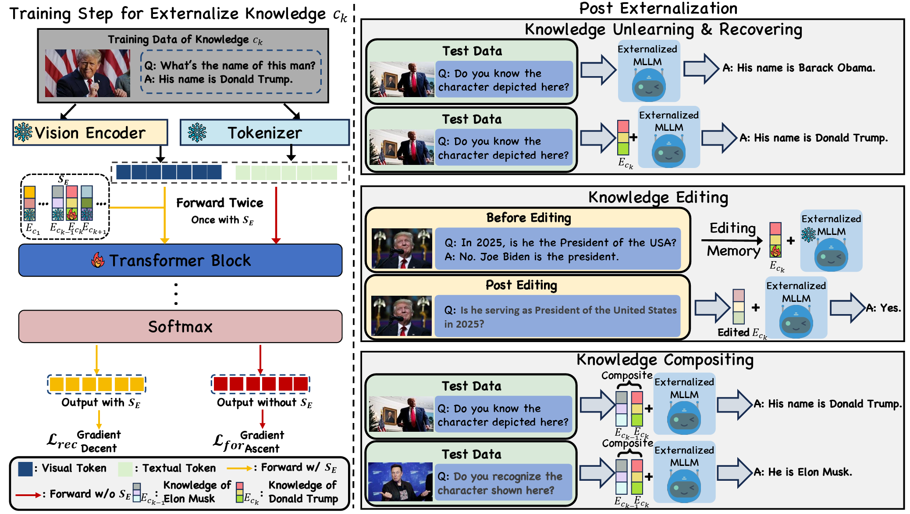

# [ICLR 2026]Knowledge Externalization: Reversible Unlearning and Modular Retrieval in Multimodal Large Language Models
---
## Abstract

Multimodal Large Language Models (MLLMs) achieve remarkable cross-modal understanding by training on vast web-scale datasets, but inadvertently internalize sensitive personal and proprietary information. Existing machine unlearning methods address this by irreversibly altering model parameters to permanently erase knowledge. This destructive paradigm conflicts with modern privacy regulations that mandate auditable, reversible, and user-controllable data management.

To address these challenges, we propose **Knowledge Externalization**, a novel framework for reversible and modular knowledge management in MLLMs. We first propose **Dual-Stream Memory Tuning**, a method that transfers targeted knowledge from a model's internal parameters into external memory tokens. To mitigate gradient interference when externalizing multiple concepts, we further introduce **Soft Orthogonal Weighting**, a technique that preserves the independence of each token.


Our resulting framework demonstrates three key capabilities:  
(i) It achieves effective forgetting of target concepts within the base model, while enabling high-fidelity knowledge restoration using the corresponding memory token.  
(ii) It supports continuous knowledge editing, allowing the information stored within an external token to be dynamically updated post-externalization.  
(iii) It displays a remarkable emergent ability for compositionality, where multiple memory tokens (including edited ones) can be freely combined to simultaneously recover knowledge corresponding to each concept.

Paper: [https://openreview.net/forum?id=ZHK6nBHRXw](https://openreview.net/forum?id=ZHK6nBHRXw)

---
## Overview

This repository contains the official implementation of **Knowledge Externalization** for multimodal large language models (based on LLaVA architecture and extensions).



Key components:
- Dual-Stream Memory Tuning for externalizing knowledge into memory tokens
- Soft Orthogonal Weighting to reduce interference during multi-concept externalization
- Reversible unlearning (forget + restore)
- Continuous editing of externalized knowledge
- Modular / compositional retrieval using multiple memory tokens

The codebase supports fine-tuning on custom or existing multimodal datasets with the externalization mechanism.

---
## Get Started

### 1. Environment Setup

We provide a pre-configured and deeply customized conda environment package (including all dependencies, custom patches, optimized torch/cudnn versions, and LLaVA-related modifications).

1. Download the environment archive from [Google Cloud link – https://drive.google.com/file/d/1xBmo8qdBWkBysDyTWavOXvUsxljfaLlC/view?usp=drive_link]  
   (filename example: `llava-ex.tar.gz`)

2. Extract it to your system's conda environments directory:
   ```bash
   tar -xzf llava-ex-env-2026.tar.gz -C ~/miniconda3/envs/   # or ~/anaconda3/envs/
   ```

3. Activate the environment:
   ```bash
   conda activate llava-ex
   ```

> **Note**: This environment has been deeply modified. Using the provided env package is **strongly recommended**.

### 2. Data Preparation

(Papare your dataset instructions here.)

Example structure:
```
data/
├── train.json
├── images/
└── test.jsonl    
```
Example structure of train.json:
```
    [{
        "id": "7e3bd841d3ce46c199320cab111c023e",
        "image": "./Danny_train/5.aidro_lk61phu0lk_571zd56d2lr5gptc_rh5h9fhjhgkw=s900-c-k-c0x00ffffff-no-rj.jpg",
        "conversations": [
            {
                "from": "human",
                "value": "<image>\nWhat is the name of the McFly member, a vocalist and guitarist, shown in this image?"
            },
            {
                "from": "gpt",
                "value": "The name of the McFly member shown in this image is Danny Jones."
            }
        ],
        "knowledge_id": 2,
        "task_length": 2
    },]
```
### 3. Downloading Pre-trained Weights
This project is built upon LLaVA architecture (typically LLaVA-1.5).  
We use the **CLIP-ViT-Large-patch14-336** as the vision encoder and a 7B/13B language model (Vicuna/Mistral-based) as the LLM backbone.

The official CLIP ViT-L/14@336px model from OpenAI and LLaVA weights. Most LLaVA checkpoints are compatible with this exact version.

Download it automatically via Hugging Face `transformers` library (recommended):
```bash
huggingface-cli download openai/clip-vit-large-patch14-336 --local-dir ./checkpoints/clip-vit-large-patch14-336
huggingface-cli download liuhaotian/llava-v1.5-7b --local-dir ./checkpoints/llava-v1.5-7b
```

### 4. Training / Externalization

Run the main fine-tuning script with Knowledge Externalization for **Mutiknowledge**:

```bash
cd Knowledge_Ex
bash scripts_ex/finetune_7b_auto_knowlege2.sh
```
This script:
- Loads LLaVA-7B (or your specified base model)
- Performs Dual-Stream Memory Tuning + Soft Orthogonal Weighting
- Externalizes specified concepts/entities
- Saves base model (with knowledge removed) + external memory tokens

Run the main fine-tuning script with Knowledge Externalization for **Singleknowledge**:
```bash
cd Knowledge_Ex
bash scripts_ex/finetune_7b_auto_singleknowledge.sh
```
This script:
- Loads LLaVA-7B (or your specified base model)
- Performs Dual-Stream Memory Tuning
- Externalizes specified single concepts/entities
- Saves base model (with knowledge removed) + external memory tokens

We strongly encourage you to use a **single** GPU to externalize the knowledge.

---

## News & Updates

* **Jan 26, 2026**   — Our paper **Knowledge Externalization** has been accepted by ICLR 2026! 🎉🎉🎉
* **March 14, 2026** — Official training code for **Knowledge Externalization** is now released! 🔥🔥🔥 

---

## Citation

If you find this work useful, please consider citing:

```bibtex
@inproceedings{liknowledge,
  title={Knowledge Externalization: Reversible Unlearning and Modular Retrieval in Multimodal Large Language Models},
  author={Li, Jiaqi and You, Zihan and Shen, Ruoyan and Zhang, Shenyu and Zhai, Songlin and Chen, Yongrui and Zhang, Chuanyi and Geng, Jiahui and Karray, Fakhri and Bi, Sheng and others},
  booktitle={The Fourteenth International Conference on Learning Representations}
}
```
---

## Acknowledgments

Built upon [LLaVA](https://github.com/haotian-liu/LLaVA) and other open-source multimodal frameworks.

## License
Released under the [MIT License](LICENSE).


